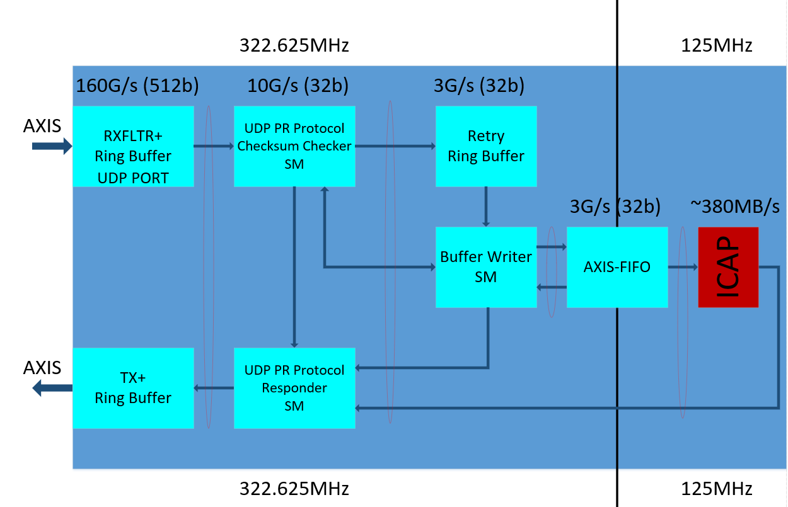
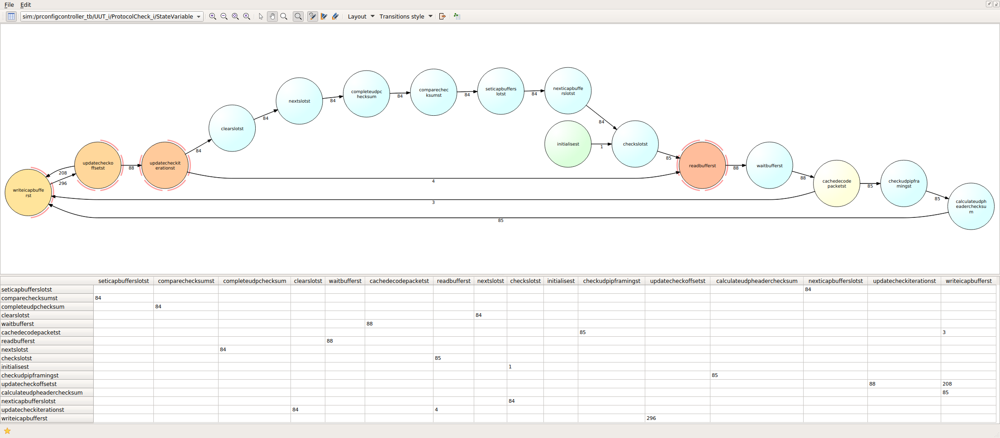
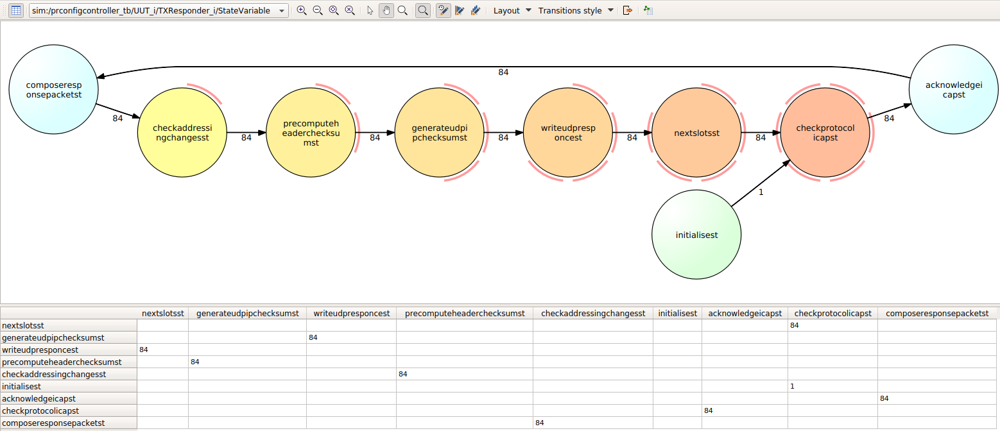
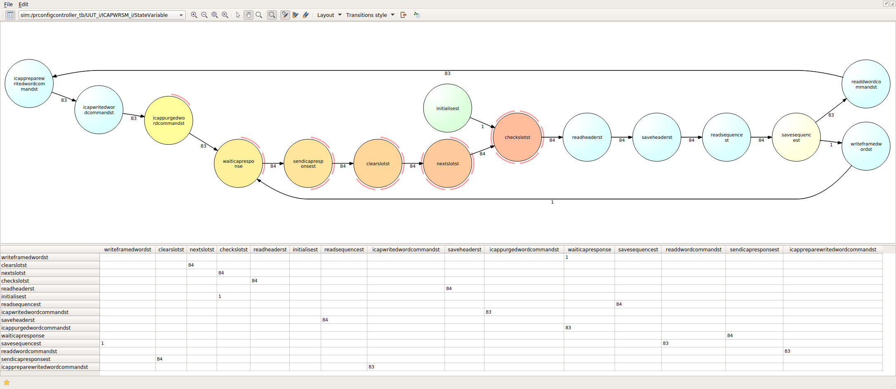
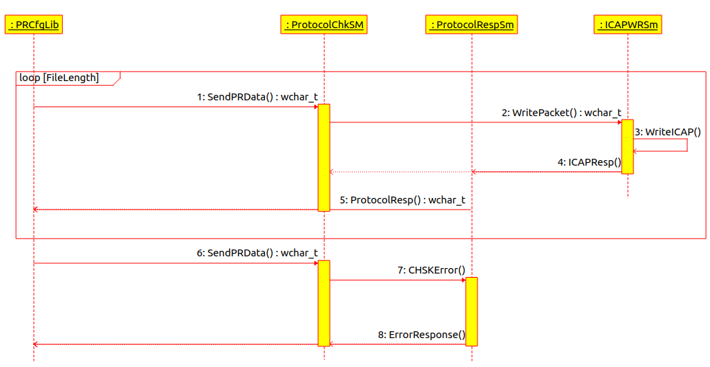

# Partial Reconfiguration Module

The partial reconfiguration block documentation describes the different functional blocks of the partial reconfiguration module.The modules represent different VHDL entities that implement the necessary logic to have coordinated sequencing and error checking to ensure partial reconfiguration is done with integrity on the FPGA.It must be noted that this module does not check the partial reconfiguration bitstream RM module for compatibility with the static region. The module only ensures data integrity and sequencing from the Work Station to the ICAP module using UDP protocol.

It is the user's responsibility to ensure that the correct RM module partial bitstream is supplied using the Python library. Writing a wrong RM module partial bitstream may lead to damage of the FPGA and unpredictable results.

To reduce partial reconfiguration time, it is recommended to use bitstream compression and DFRAME_MODE packet interface. When using PERFRAME_CRC it is not possible to use bitstream encryption as such FRAME_MODE packet interface must be used.FRAME_MODE packet interface will be slower than DFRAME_MODE packet interface due to the extra steps required to send DWORD_WRITE packets and the lack of bitsream compression.

All packet modes support bitstream encryption. For increased security the module doesn't support frame readback. Status register read is supported in order to give the user access to the FPGA configuration register status. Some status registers wont be available depending on the static bistream and device security settings.

# Table of Contents
[TOC]

# Introduction

The module block diagram is shown in the figure below:

The partial reconfiguration ICAP runs at 125MHz clock.
The partial reconfigration module is made up of the following blocks

* Receive ring buffer

* Transmit ring buffer

* Protocol checker state machine

* Protocol responder state machine

* Retry ring buffer

* ICAP writer state machine

The ICAP Block can ingest data at a rate of 380MB/s however the FPGA internal configuration state machine may not be able to accept configuration bitstream data at this rate. In such cases the FPGA will control the flow of configuration data through the ICAP AVAIL signal. The PR Module has ability to throttle data according to the FPGA's internal configuration state machine control signals through the ICAP AVAIL signal using a FIFO.

Bitstream rate flow control data is always sent to the Work station through response packets from the Protocol Responder.

## Partial Reconfiguration UDP Protocol

UDP is used as the basic protocol for interacting with the Partial Reconfiguration module.
The granurality of the protocol is 32 Bit WORD as per Xilinx Bitsream command and data granurality.

The transmit packets (excluding all UDP/IP/Ethernet framing data) follows a basic structure as follows:

| PR Module Command (8 bits) | Packet DWORD Length (8 bits) | Packet Sequence (32 bits) | Packet DWORD(s) Data (32 bits x Packet DWORD Length) |
|:-------------------:|:---------------------:|:---------------------:|:------------------:|
|DWORD_WRITE          | 0x01                  | N (Modulo 32)         | DWORD_DATA (32 bit)|
|DWORD_READ           | 0x01                  | N (Modulo 32)         | NULL (32 bit)      |
|FRAME_WRITE          | 0x62                  | N (Modulo 32)         | DWORD_DATA (32 bit) x 0x62      |
|DFRAME_WRITE         | NLEN                  | N (Modulo 32)         | DWORD_DATA (32 bit) x NLEN      |

### 32 Bit Word Write (DWORD_WRITE)

The DWORD_WRITE packet is used to send 32 Bit data to the PR Module.
The protocol ID for DWORD_WRITE = 0xDA

The DWORD_WRITE packet (excluding all UDP/IP/Ethernet framing data) follows a basic structure as follows:

| DWORD_WRITE Code  (8 bits) | Packet DWORD Length (8 bits) | Packet Sequence (32 bits) | Packet DWORD(s) Data (32 bits x Packet DWORD Length) |
|:-------------------:|:---------------------:|:---------------------:|:------------------:|
|0xDA                 | 0x01                  | N (Modulo 32)         | DWORD_DATA (32 bit)|

### 32 Bit Word Read (DWORD_READ)

The DWORD_READ packet is used to retreive 32 Bit data to the PR Module.
The protocol ID for DWORD_READ = 0xDE

The DWORD_READ packet (excluding all UDP/IP/Ethernet framing data) follows a basic structure as follows:

| DWORD_READ Code  (8 bits) | Packet DWORD Length (8 bits) | Packet Sequence (32 bits) | Packet DWORD(s) Data (32 bits x Packet DWORD Length) |
|:-------------------:|:---------------------:|:---------------------:|:------------------:|
|0xDE                 | 0x01                  | N (Modulo 32)         | NULL_DATA (32 bit)|

It is important to know that the DWORD_READ only reads the output that is already present on the ICAP OUTPUT port.

The user must first issue an instruction to the ICAP module using DWORD_WRITE to send the corresponding register read instruction to the ICAP module for the readbWhere NLen is a number  1 >=< 232

Never send more than 1024 bytes total frame as that will cause a wrap around on the Ring Buffer.
ack.

### Dynamic Length Frame Write (DFRAME_WRITE)

The DFRAME_WRITE packet is used to send a dynamics length frame of 32 Bit data to the PR Module.
The protocol ID for DFRAME_WRITE = 0xAD

The DFRAME_WRITE packet (excluding all UDP/IP/Ethernet framing data) follows a basic structure as follows:

| DFRAME_WRITE Code  (8 bits) | Packet DWORD Length (8 bits) | Packet Sequence (32 bits) | Packet DWORD(s) Data (32 bits x Packet DWORD Length) |
|:-------------------:|:---------------------:|:---------------------:|:------------------:|
|0xAD                 | NLen                  | N (Modulo 32)         | FRAME_DATA (32 bit) x NLen|

Where NLen is a number  1 >=< 232

Never send more than 1024 bytes total frame as that will cause a wrap around on the Ring Buffer.

### Perframe CRC Frame Write (FRAME_WRITE)

The FRAME_WRITE packet is used to send a fixed length frame of 0x62 of 32 Bit data to the PR Module.
The protocol ID for FRAME_WRITE = 0xA5

The FRAME_WRITE packet (excluding all UDP/IP/Ethernet framing data) follows a basic structure as follows:

| FRAME_WRITE Code  (8 bits) | Packet DWORD Length (8 bits) | Packet Sequence (32 bits) | Packet DWORD(s) Data (32 bits x Packet DWORD Length) |
|:-------------------:|:---------------------:|:---------------------:|:------------------:|
|0xA5                 | 0x62                  | N (Modulo 32)         | FRAME_DATA (32 bit) x 0x62|

This frame is used to send PERFRAME_CRC packets for UltraScale+ Devices.

### 32 Bit Word Responce from PR Module

The 32 bit packet responce from the PR Module returns a number of status bits together with error reporting bit fields.

The protocol ID for DWORD_WRITE = 0xDA

The DWORD_WRITE packet (excluding all UDP/IP/Ethernet framing data) follows a basic structure as follows:

| PACKETID Code  (16 bits) | Packet Sequence (32 bits) | STATUS DWORD (32 bits ) |
|:-------------------:|:---------------------:|:------------------:|
| PACKETID            | N (Modulo 32)         | DWORD_DATA (32 bit)|

The PacketID has the follwoing bit fields:

* ICAP_DONE (1 bit)
* ICAP_PRERROR (1 bit)
* Number of Filled Slots (4 bits)
* ICAP FIFO Full (1 bit)
* ICAP FIFO Empty (1 bit)
* ICAP Protocol ID (8 bits)

The arrangement of the bit field on the PacketID is as follows:

| Bits (15-8)         | Bit(7 to 4)           | Bit (3)            | Bit (2)            | Bit (1) | Bit (0) |
|:-------------------:|:---------------------:|:------------------:|:------------------:|:------------------:|:------------------:|
| ICAP ProtocolID            | N Filled Slots         | ICAP_PRERROR | ICAP_DONE | ICAP_FIFO_FULL | ICAP_FIFO_EMPTY|

## Partial Reconfig Firmware Modules

### Protocol Checksum Checker State Machine

This state machine checks for integrity of the UDP frames.If there is a problem in the framming or a UDP checksum error, this statemachine will flag the error and issue the error response to the UDP packet sender through the protocol responder state machine. If a packet has good framing and a correct UDP checksum, it will then be forwarded to the ICAP Writer State Machine for transfer into the ICAP FPGA programming interface.

### Protocol Responder State Machine

This state machine is used to send UDP response packets with status information of the partial reconfiguration module. Both status and error response packet are sent by this module as per the packet structure that was described on the packet response framing structure.

### ICAP Writer State Machine

The ICAP Writer state machine is used to write the partial reconfiguration frames to the FPGA ICAP programming interface. 

## Software Interface

### Simple Partial Reconfiguration Sequence Diagram

The simple partial reconfiguration programming interface uses a single thread for the the programming of the FPGA.
The actors on the sequence are:
* Partial reconfiguration Library (Linux Workstation)
* Protocol Checksum Checker State Machine (FPGA)
* Protocol Responder State Machine (FPGA)
* ICAP Write State Machine (FPGA)

Using this simple transmit-> acknowledge mechanism it is possible to have decent partial reconfiguration performance time. This is the current implementation on the partial reconfiguration C library.

### Advanced Partial Reconfiguration using sliding window protocol

It is possible with minor changes to enhance the performance of the partial reconfiguration interface by using sliding window transfer protocols. A suitable protocol would be the sliding window with go back N as the FPGA would be able to acknowledge each packet and stop where there is an error.

Sliding window protocols could be implemented on the partial reconfiguration C library using multi-threaded architecture to facilitate the needed messaging and enhanced data transfer speeds.

